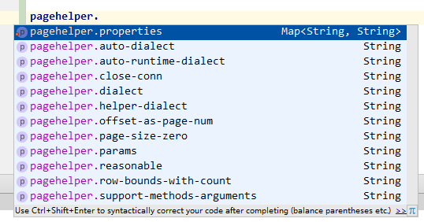

# PageHelper integration with Spring Boot

PageHelper-Spring-Boot-Starter 帮助你集成分页插件到 Spring Boot。

PageHelper-Spring-Boot-Starter will help you use PageHelper with Spring Boot.

Support PageHelper 5.x

## How to use
在 pom.xml 中添加如下依赖：

Add the following dependency to your pom.xml: 
```xml
<dependency>
    <groupId>com.github.pagehelper</groupId>
    <artifactId>pagehelper-spring-boot-starter</artifactId>
    <version>1.2.13</version>
</dependency>
```

## v1.2.13 - 2019-11-26

- 升级 PageHelper 到 5.1.11
- 升级 MyBatis 到 3.5.3
- 升级 MyBatis Starter 到 2.1.1
- 升级 springboot 到 2.2.1.RELEASE

## v1.2.12 - 2019-06-05

- 升级 PageHelper 到 5.1.10

## v1.2.11 - 2019-05-29

- 升级 PageHelper 到 5.1.9
- 升级 MyBatis 到 3.5.1
- 升级 MyBatis Starter 到 2.0.1
- 升级 springboot 到 2.1.5.RELEASE

## v1.2.10 - 2018-11-11

- 升级 PageHelper 到 5.1.8
- 升级 springboot 到 2.1.0.RELEASE

## v1.2.9 - 2018-10-11

- 升级 PageHelper 到 5.1.7

>v1.2.8 由于未修改版本，仍然和 v1.2.7 相同。

## v1.2.7 - 2018-09-04

- 升级 PageHelper 到 5.1.6


## v1.2.6 - 2018-09-04

- 升级 PageHelper 到 5.1.5


## v1.2.5 - 2018-04-22

- 升级 PageHelper 到 5.1.4（默认增加对达梦数据库的支持）
- 升级 MyBatis 到 3.4.6

## v1.2.4 - 2018-04-07

- 升级 PageHelper 到 5.1.3
- 升级 springboot 到 2.0.1.RELEASE
- 增加 dialectAlias 参数，允许配置自定义实现的 别名，可以用于根据JDBCURL自动获取对应实现，允许通过此种方式覆盖已有的实现，配置示例如(多个配置用分号`;`隔开)：
  ```properties
  pagehelper.dialect-alias=oracle=com.github.pagehelper.dialect.helper.OracleDialect
  ```
- 增加 defaultCount 参数，用于控制默认不带 count 查询的方法中，是否执行 count 查询，默认 true 会执行 count 查询，这是一个全局生效的参数，多数据源时也是统一的行为。配置示例如：
  ```properties
  pagehelper.default-count=false
  ```


## v1.2.3 - 2017-09-25

- 修改属性获取方式，兼容 Spring Boot 1.x 和 2.x
- 第三方扩展分页插件时使用到额外属性时，配置属性要和属性名完全匹配
- 升级 springboot 到 1.5.7.RELEASE
- 升级 MyBatis-Starter 版本到 1.3.1

## v1.2.2 - 2017-09-18

- 升级 pagehelper 到 5.1.2

## v1.2.1 - 2017-08-30

- 升级 pagehelper 到 5.1.1

## v1.2.0 - 2017-08-28

- 升级 pagehelper 到 5.1.0

## v1.1.3 - 2017-08-01

- 升级 pagehelper 到 5.0.4
- 升级 springboot 到 1.5.6.RELEASE

## v1.1.2 - 2017-06-28 by [drtrang](https://github.com/drtrang)

- 升级 pagehelper 到 5.0.3
- 升级 springboot 到 1.5.4.RELEASE
- 将 maven-compiler-plugin 和 maven-source-plugin 从 release profile 中提出来作为全局插件，并且增加继承属性，解决 `PageHelperAutoConfiguration` 类中的 `@Override` 报错问题。

## v1.1.1 - 2017-04-25
- 增加多数据源支持 [#pr6](https://github.com/pagehelper/pagehelper-spring-boot/pull/6) by [yangBin666](https://github.com/yangBin666)
- 升级分页插件 PageHelper 版本到 5.0.1
- 升级 MyBatis 版本到 3.4.4
- 升级 Spring Boot 版本到 1.5.3.RELEASE
- 升级 MyBatis-Starter 版本到 1.3.0

## v1.1.0 - 2017-02-04
- 解决可能会注册两次分页插件的问题。
- 增加 PageHelperProperties 注入，常用属性可以通过 IDE 自动提示



## Example
>https://github.com/abel533/MyBatis-Spring-Boot

## PageHelper
>https://github.com/pagehelper/Mybatis-PageHelper

## Special Configurations
一般情况下，你不需要做任何配置。

Normally, you don't need to do any configuration.

如果需要配置，可以使用如下方式进行配置：

You can config PageHelper as the following:

application.properties:
```properties
pagehelper.propertyName=propertyValue
```
注意 pagehelper 配置，因为分页插件根据自己的扩展不同，支持的参数也不同，所以不能用固定的对象接收参数，所以这里使用的 `Map<String,String>`，因此参数名是什么这里就写什么，IDE 也不会有自动提示。

关于可配置的属性请参考 [如何使用分页插件](https://github.com/pagehelper/Mybatis-PageHelper/blob/master/wikis/zh/HowToUse.md)。

You can configure the properties of the reference here [How to use the PageHelper](https://github.com/pagehelper/Mybatis-PageHelper/blob/master/wikis/en/HowToUse.md).

## Interceptor Order

如果你想要控制 拦截器插件的顺序，可以通过下面注解控制：

If you want to control the order in which the interceptor plug-in, you can use the following annotation control:
```java
@AutoConfigureAfter(PageHelperAutoConfiguration.class)
//Or
@AutoConfigureBefore(PageHelperAutoConfiguration.class)
```
